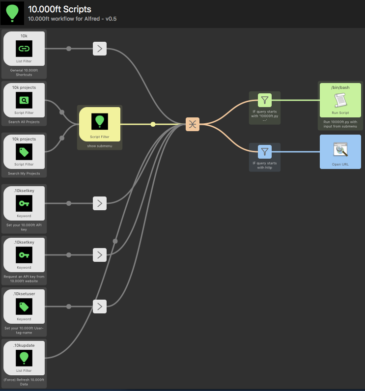
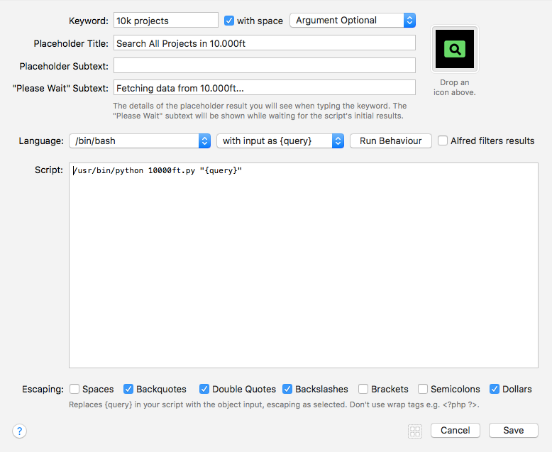

# 10.000ft Scripts - Workflow for Alfred #
10.000ft workflow for Alfred (only tested in Alfred3), the aim is to make working with 10.000ft faster.

In june 2016 I wrote the first versions of this script (up to 0.4). It was a very simple first version as a research project to learn python. It was not really meant for distribution. But it saves me a lot of time every working day and I like to share this with other Alfred enthousiasts and hope to get some feedback and learn more. I am curious if you like it, just try it, let me know what you think or [report a bug](https://github.com/jceelen/alfred-10000ft-scripts/issues)  if you encounter them :-). I am happy to help with questions.

## Features ##
- Saves your API key secure in the in the OSX Keychain
- Gets realtime data (and saves it in cache) from 10.000ft using the API
- Submenu with options for every project
 - Open the View and Edit page in browser
 - Time & Fees reports for projects
 - Archive or Delete projects directly from Alfred 
- Filter for 'My projects' (based on tags)
- Force update cached data from Alfred

## Download and installation ##
Download the latest version from the [GitHub releases page](https://github.com/jceelen/alfred-10000ft-scripts/releases/latest)

Copy your API key to the clipboard, and use `.10ksetkey` to save your API key

[Request your 10.000ft API Key](http://10000ft.us6.list-manage2.com/subscribe?u=9c2ec42cba0e4196798807690&id=be8afd4d34)

## Usage ##
- `.10ksetkey` — saves your 10.000ft API key to the OSX Keychain
- `10k projects` or hotkey `cmd+'` - shows a list of active projects which you can filter
- `.10ksetuser` — sets your 10.000ft User-tag-name (for feature in the future)
- `.10kupdate` — update of your 10.000ft project data (opens submenu with refresh or force)

### Shortcuts ###
- `10k home` — open your 10000ft.com homepage
- `10k planning` — open the Schedule view
- `10k analytics` — open the Analytics view

## Changelog
#### v0.5.5
- Fix for update loop where the script keeps showing the `Fetching data from 10.000ft message`
- updated reports to work with 10.000ft v3 reports
- simplified logging
- cleaned up files

#### v0.5.4
- hotfix for pycurl and openssl
- upgraded alfred-workflow to v1.32

#### v0.5.3
- Added Hotkey
- Improved force update cache through Alfred and when archiving or deleting a project
- Fixed encoding issue with urlencode

#### v0.5.2
- Hotfix for bug deleting / archiving projects

#### v0.5.1
- Updated Alfred-Workflow to 1.24 (from 1.17.3)
- Added Force update data which dumps projects cache
- Added My projects (based on tags)
- Added Fees report for project
- Added Archive project option in submenu
- Added Delete project option in submenu
- Fixed XML encoding error in log
- Fixed Bug that caused Alfred to crash if the Project Client was null / None
- Improved Errorhandling
- Improved Updating data, it checks if an update is already running now
- Improved Function for building report URLs
- Improved Encoding / Decoding behaviour
- Improved Flow & Descriptions in Alfred
- Improved Inline documentation
- Refactored a lot of double code into functions

#### v0.4
- Added submenu with options for every project
- Changed usage
- Add create report for project
- Add view project
- Fixed caching
- Simplified workflow in Alfred
- Added project icons based on status (confirmed, tentative, internal)

#### v0.3
- Added automatic updates

## Thanks, Copyright, Licensing ##
- The awesome [Alfred-Workflow](http://www.deanishe.net/alfred-workflow/) library by [Deanishe](https://github.com/deanishe)
- Icons are based on [Material design icons](https://github.com/google/material-design-icons) created and maintained by Google.

All other code/media are released under the [MIT-licensed](http://opensource.org/licenses/MIT). 
